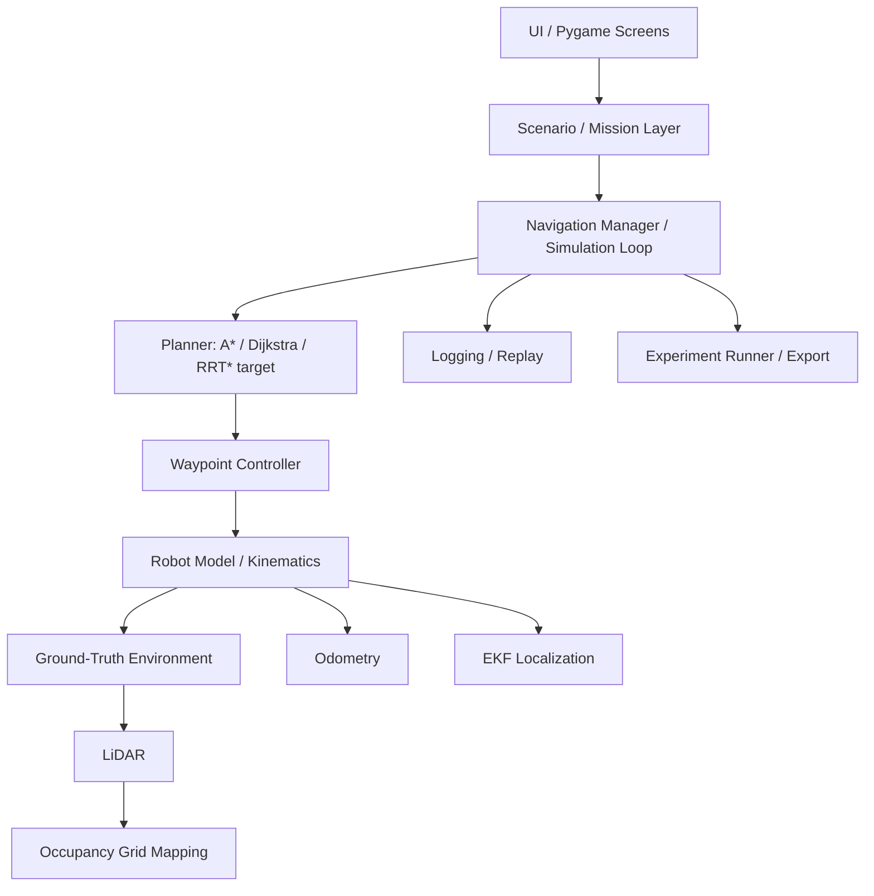
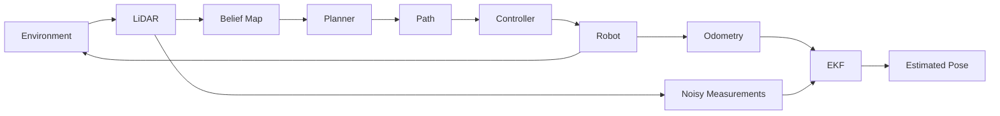

# Architecture

The simulator separates robotics logic from UI rendering so each subsystem can be inspected, tested, and discussed independently.

## High-Level Stack

## Runtime Data Flow

## Major Modules

- `app.py`: application state routing between home, simulation, editor, replay, results, and experiments
- `simulator/simulation_loop.py`: frame integration, controls, planning, sensing, mapping, logging, replay, and dashboard updates
- `environment/`: scenarios, grid geometry, dynamic obstacles, and collision checks
- `planning/`: graph search, path smoothing, replanning, and frontier selection
- `robot/`: state, kinematics, odometry, and EKF localization
- `sensors/`: LiDAR ray casting
- `ai/`: local mission parser and mission manager
- `experiments/`: repeated trials, statistics, dashboard data, and export files
- `ui/` and `visualization/`: screens, theme, reusable UI components, robot rendering, and maps

## Frame Sequence

1. Poll keyboard and mouse input.
2. Update dynamic obstacles.
3. Resolve mission/autonomous/exploration targets.
4. Replan when the path is missing, blocked, or stale.
5. Convert waypoints into velocity commands.
6. Apply collision-checked robot motion.
7. Update odometry and EKF estimates.
8. Cast LiDAR rays and update the belief map.
9. Log frame data if logging is enabled.
10. Draw the dashboard.

Replay mode skips physics and planner updates and displays logged states through the same dashboard renderer.
